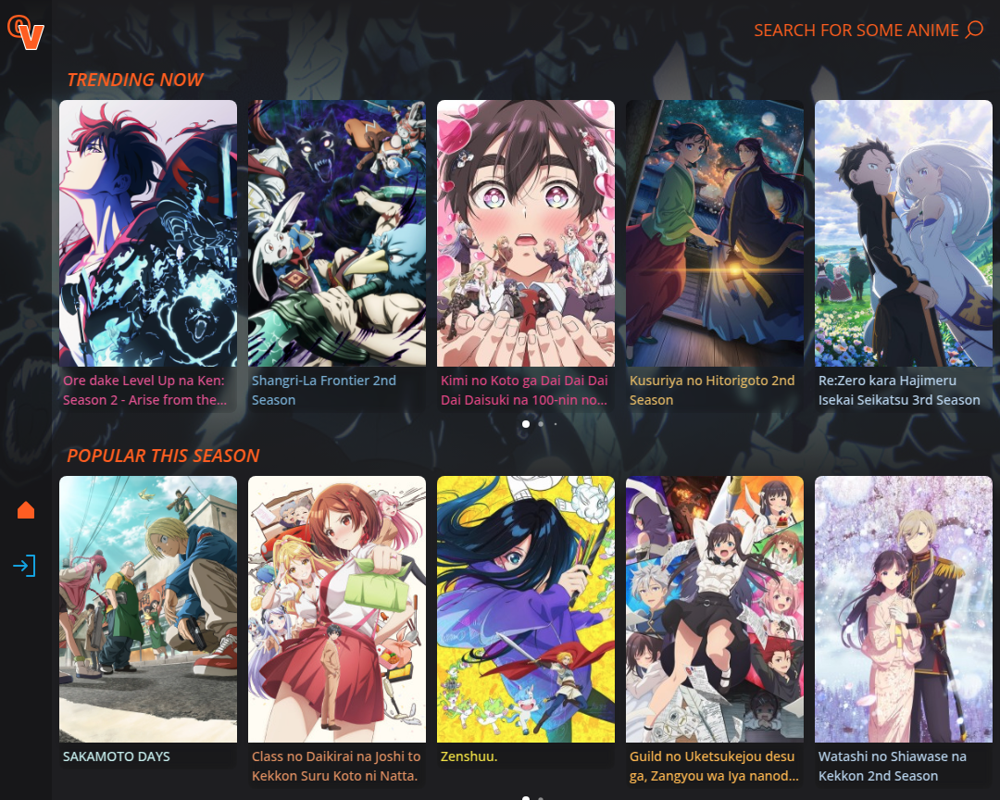
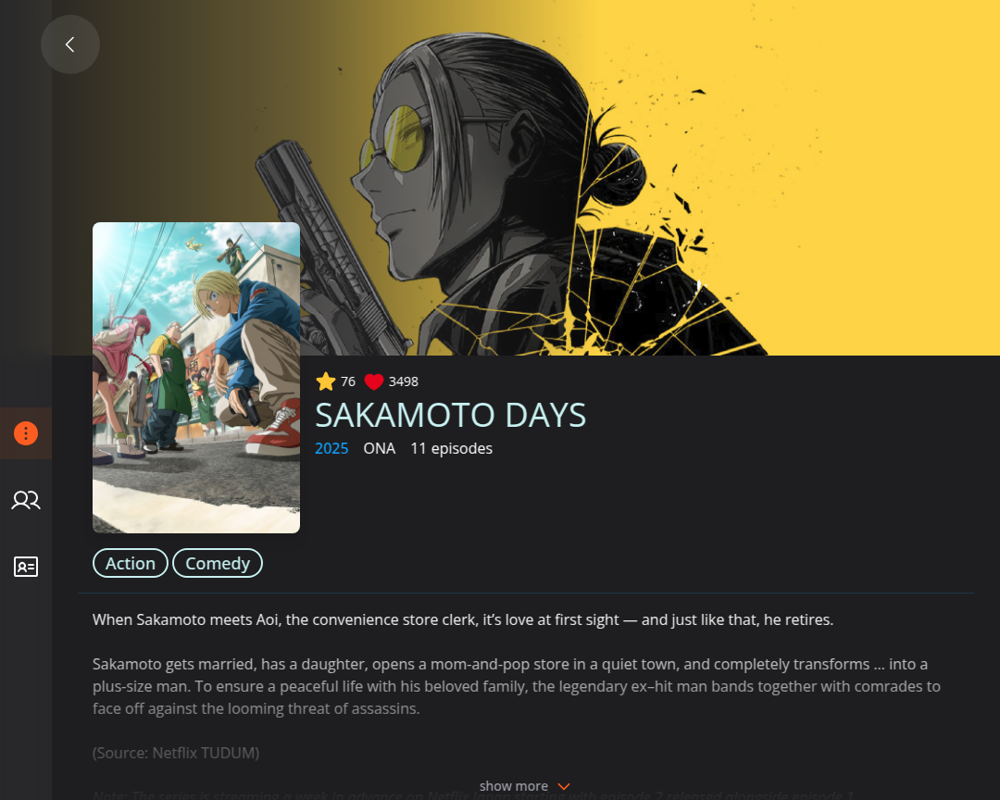
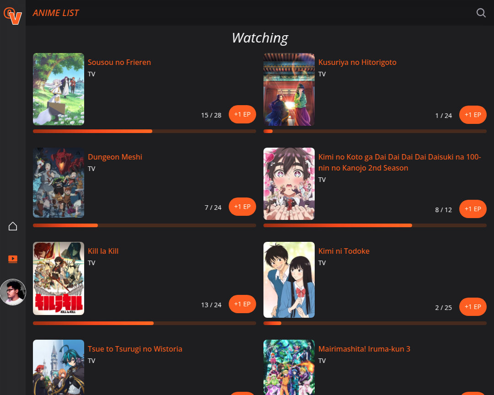
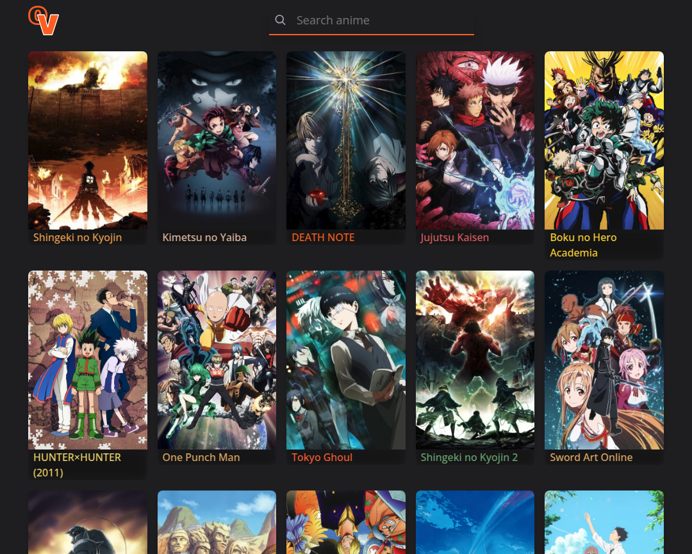

<h1 align="center">
  
</h1>

Site de animes e mangás com uma vasta biblioteca de títulos e informações sobre eles. O objetivo deste projeto é fornecer aos usuários um local centralizado para encontrar informações sobre animes e mangás de forma rápida e fácil.

<!-- ## ⚙️ Funcionalidades
- **Cadastro e exclusão de jobs**: Adicione ou remova facilmente seus projetos.
- **Estimativa de custo**: Obtenha uma previsão de quanto cada job pode custar.
- **Cálculo do valor da hora**: Calcule automaticamente o seu valor de hora de trabalho com base nos seus dados. -->

## 🛠 Tecnologias Utilizadas

- **React**
- **Tailwind CSS**
- **Typescript**
- **GraphQL**

## 🚀 Acesse o Projeto
Você pode acessar o projeto online através do seguinte link:

[**Clique aqui para acessar**](https://otakuverissimo.vercel.app/).

## 📸 Capturas de Tela
Aqui estão algumas capturas de tela do projeto em funcionamento:

---

Feito com 💙 por [francisverissimo](https://francissportfolio.vercel.app/)